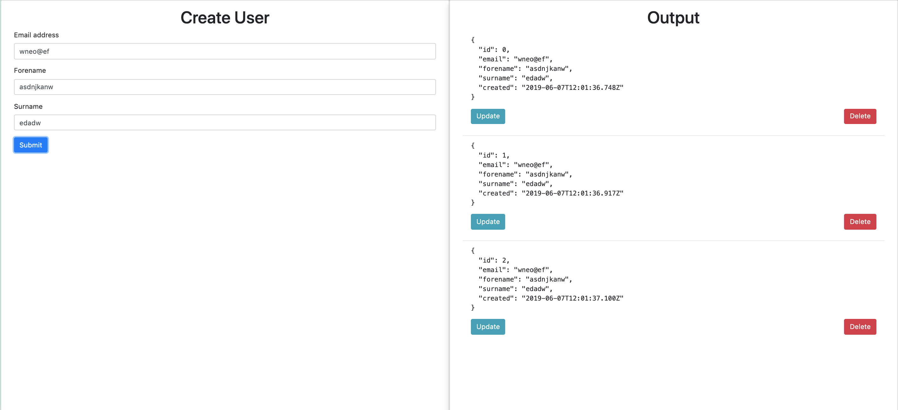

# Web API

Web API created with Node.js (hosted on local machine).

## Installation

Use the package manager npm to install the dependencies.

cd into the challenge folder and run:
```bash
npm install package.json
```

## Run the server

Once all the dependencies have installed, run:

```bash
npm start
```

This will tell nodemon to host the server.



